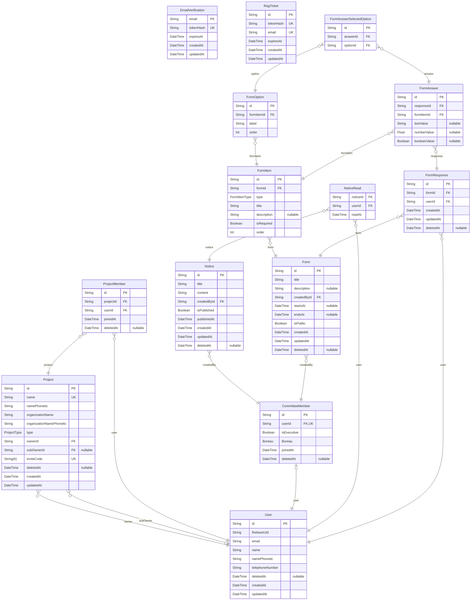

# ER図

> Generated by [`prisma-markdown`](https://github.com/samchon/prisma-markdown)

- [default](#default)

## default

### `EmailVerification`

Properties as follows:

- `email`:
- `tokenHash`:
- `expiresAt`:
- `createdAt`:
- `updatedAt`:

### `RegTicket`

Properties as follows:

- `id`:
- `tokenHash`:
- `email`:
- `expiresAt`:
- `createdAt`:
- `updatedAt`:

### `User`

Properties as follows:

- `id`:
- `firebaseUid`:
- `email`:
- `name`:
- `namePhonetic`:
- `telephoneNumber`:
- `deletedAt`:
- `createdAt`:
- `updatedAt`:

### `Project`

Properties as follows:

- `id`:
- `name`:
- `namePhonetic`:
- `organizationName`:
- `organizationNamePhonetic`:
- `type`:
- `ownerId`:
- `subOwnerId`:
- `inviteCode`:
- `deletedAt`:
- `createdAt`:
- `updatedAt`:

### `ProjectMember`

Properties as follows:

- `id`:
- `projectId`:
- `userId`:
- `joinedAt`:
- `deletedAt`:

### `CommitteeMember`

Properties as follows:

- `id`:
- `userId`:
- `isExecutive`:
- `Bureau`:
- `joinedAt`:
- `deletedAt`:

### `Notice`

Properties as follows:

- `id`:
- `title`:
- `content`:
- `createdById`:
- `isPublished`:
- `publishedAt`:
- `createdAt`:
- `updatedAt`:
- `deletedAt`:

### `NoticeRead`

Properties as follows:

- `noticeId`:
- `userId`:
- `readAt`:

### `Form`

Properties as follows:

- `id`:
- `title`:
- `description`:
- `createdById`:
- `startsAt`:
- `endsAt`:
- `isPublic`:
- `createdAt`:
- `updatedAt`:
- `deletedAt`:

### `FormItem`

Properties as follows:

- `id`:
- `formId`:
- `type`:
- `title`:
- `description`:
- `isRequired`:
- `order`:

### `FormOption`

Properties as follows:

- `id`:
- `formItemId`:
- `label`:
- `order`:

### `FormResponse`

Properties as follows:

- `id`:
- `formId`:
- `userId`:
- `createdAt`:
- `updatedAt`:
- `deletedAt`:

### `FormAnswer`

Properties as follows:

- `id`:
- `responseId`:
- `formItemId`:
- `textValue`:
- `numberValue`:
- `booleanValue`:

### `FormAnswerSelectedOption`

Properties as follows:

- `id`:
- `answerId`:
- `optionId`:
