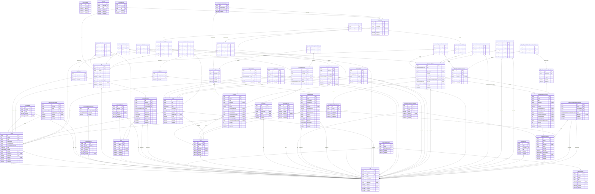

# ER図

> Generated by [`prisma-markdown`](https://github.com/samchon/prisma-markdown)

- [default](#default)

## default

```mermaid
erDiagram
"EmailVerification" {
  String email PK
  String tokenHash UK
  DateTime expiresAt
  DateTime createdAt
  DateTime updatedAt
}
"RegTicket" {
  String id PK
  String tokenHash UK
  String email UK
  DateTime expiresAt
  DateTime createdAt
  DateTime updatedAt
}
"User" {
  String id PK
  String firebaseUid
  String email UK
  String name
  String namePhonetic
  String telephoneNumber
  String avatarFileId "nullable"
  SendKey sendKey
  DateTime deletedAt "nullable"
  DateTime createdAt
  DateTime updatedAt
}
"Project" {
  String id PK
  Int number UK
  String name UK
  String namePhonetic
  String organizationName
  String organizationNamePhonetic
  ProjectType type
  ProjectLocation location
  String ownerId FK
  String subOwnerId FK "nullable"
  String(6) inviteCode UK
  DateTime deletedAt "nullable"
  DateTime createdAt
  DateTime updatedAt
}
"ProjectMember" {
  String id PK
  String projectId FK
  String userId FK
  DateTime joinedAt
  DateTime deletedAt "nullable"
}
"ProjectSubOwnerRequest" {
  String id PK
  String projectId FK
  String userId FK
  SubOwnerRequestStatus status
  String pendingProjectId UK "nullable"
  DateTime decidedAt "nullable"
  DateTime createdAt
  DateTime updatedAt
}
"CommitteeMember" {
  String id PK
  String userId FK,UK
  Boolean isExecutive
  Bureau Bureau
  DateTime joinedAt
  DateTime deletedAt "nullable"
}
"CommitteeMemberPermission" {
  String id PK
  String committeeMemberId FK
  CommitteePermission permission
  DateTime createdAt
}
"PushSubscription" {
  String id PK
  String endpoint UK
  String p256dh
  String auth
  DateTime deletedAt "nullable"
  DateTime expiresAt "nullable"
  DateTime createdAt
  DateTime updatedAt
}
"UserPushSubscription" {
  String id PK
  String userId FK
  String pushSubscriptionId FK
  DateTime createdAt
  DateTime updatedAt
}
"File" {
  String id PK
  String key UK
  String fileName
  String mimeType
  Int size
  Boolean isPublic
  FileStatus status
  String uploadedById FK
  DateTime deletedAt "nullable"
  DateTime createdAt
  DateTime updatedAt
}
"Notice" {
  String id PK
  String ownerId FK
  String title
  String body "nullable"
  DateTime deletedAt "nullable"
  DateTime createdAt
  DateTime updatedAt
}
"NoticeCollaborator" {
  String id PK
  String noticeId FK
  String userId FK
  DateTime deletedAt "nullable"
  DateTime createdAt
  DateTime updatedAt
}
"NoticeAuthorization" {
  String id PK
  String noticeId FK
  String requestedById FK
  String requestedToId FK
  NoticeAuthorizationStatus status
  DateTime decidedAt "nullable"
  DateTime deliveredAt
  DeliveryMode deliveryMode
  ProjectType filterTypes
  ProjectLocation filterLocations
  DateTime createdAt
  DateTime updatedAt
}
"NoticeDelivery" {
  String id PK
  String noticeAuthorizationId FK
  String projectId FK
  DateTime createdAt
}
"Form" {
  String id PK
  String ownerId FK
  String title
  String description "nullable"
  DateTime deletedAt "nullable"
  DateTime createdAt
  DateTime updatedAt
}
"FormViewer" {
  String id PK
  String formId FK
  ViewerScope scope
  Bureau bureauValue "nullable"
  String userId FK "nullable"
  DateTime deletedAt "nullable"
  DateTime createdAt
}
"FormItem" {
  String id PK
  String formId FK
  String label
  String description "nullable"
  FormItemType type
  Boolean required
  Int constraintMinLength "nullable"
  Int constraintMaxLength "nullable"
  String constraintPattern "nullable"
  String constraintCustomPattern "nullable"
  Int constraintMinFiles "nullable"
  Int constraintMaxFiles "nullable"
  String constraintAllowedMimeTypes "nullable"
  Int sortOrder
  DateTime createdAt
  DateTime updatedAt
}
"FormItemOption" {
  String id PK
  String formItemId FK
  String label
  Int sortOrder
  DateTime createdAt
  DateTime updatedAt
}
"FormCollaborator" {
  String id PK
  String formId FK
  String userId FK
  Boolean isWrite
  DateTime deletedAt "nullable"
  DateTime createdAt
  DateTime updatedAt
}
"ProjectRegistrationFormCollaborator" {
  String id PK
  String formId FK
  String userId FK
  Boolean isWrite
  DateTime deletedAt "nullable"
  DateTime createdAt
  DateTime updatedAt
}
"FormAuthorization" {
  String id PK
  String formId FK
  String requestedById FK
  String requestedToId FK
  ApprovalStatus status
  DateTime decidedAt "nullable"
  DateTime scheduledSendAt
  DateTime deadlineAt "nullable"
  Boolean allowLateResponse
  Boolean required
  Boolean ownerOnly
  DeliveryMode deliveryMode
  ProjectType filterTypes
  ProjectLocation filterLocations
  DateTime createdAt
  DateTime updatedAt
}
"FormDelivery" {
  String id PK
  String formAuthorizationId FK
  String projectId FK
  DateTime createdAt
}
"FormResponse" {
  String id PK
  String formDeliveryId FK,UK
  String respondentId FK
  DateTime submittedAt "nullable"
  DateTime createdAt
  DateTime updatedAt
}
"FormAnswer" {
  String id PK
  String formResponseId FK
  String formItemId FK
  String textValue "nullable"
  Float numberValue "nullable"
  DateTime createdAt
  DateTime updatedAt
}
"FormAnswerFile" {
  String id PK
  String answerId FK
  String fileId FK
  Int sortOrder
  DateTime createdAt
}
"FormAnswerSelectedOption" {
  String id PK
  String formAnswerId FK
  String formItemOptionId FK
  DateTime createdAt
}
"NoticeReadStatus" {
  String id PK
  String noticeDeliveryId FK
  String userId FK
  DateTime createdAt
}
"NoticeAttachment" {
  String id PK
  String noticeId FK
  String fileId FK
  DateTime deletedAt "nullable"
  DateTime createdAt
  DateTime updatedAt
}
"Inquiry" {
  String id PK
  String title
  String body
  InquiryStatus status
  String createdById FK
  InquiryCreatorRole creatorRole
  String projectId FK
  String relatedFormId FK "nullable"
  Boolean isDraft
  DateTime deletedAt "nullable"
  DateTime createdAt
  DateTime updatedAt
}
"InquiryAssignee" {
  String id PK
  String inquiryId FK
  String userId FK
  InquiryAssigneeSide side
  Boolean isCreator
  DateTime assignedAt
  DateTime deletedAt "nullable"
}
"InquiryViewer" {
  String id PK
  String inquiryId FK
  ViewerScope scope
  Bureau bureauValue "nullable"
  String userId FK "nullable"
  DateTime deletedAt "nullable"
  DateTime createdAt
}
"InquiryComment" {
  String id PK
  String inquiryId FK
  String body
  String createdById FK
  InquiryCreatorRole senderRole
  Boolean isDraft
  DateTime deletedAt "nullable"
  DateTime createdAt
  DateTime sentAt "nullable"
}
"InquiryActivity" {
  String id PK
  String inquiryId FK
  InquiryActivityType type
  String actorId FK
  String targetId FK "nullable"
  DateTime deletedAt "nullable"
  DateTime createdAt
}
"MastersheetColumn" {
  String id PK
  MastersheetColumnType type
  String name
  String description "nullable"
  Int sortOrder
  String createdById FK
  String formItemId FK,UK "nullable"
  String projectRegistrationFormItemId FK,UK "nullable"
  MastersheetDataType dataType "nullable"
  MastersheetColumnVisibility visibility "nullable"
  DateTime createdAt
  DateTime updatedAt
}
"MastersheetColumnOption" {
  String id PK
  String columnId FK
  String label
  Int sortOrder
}
"MastersheetCellValue" {
  String id PK
  String columnId FK
  String projectId FK
  String textValue "nullable"
  Float numberValue "nullable"
  DateTime createdAt
  DateTime updatedAt
}
"MastersheetCellSelectedOption" {
  String id PK
  String cellId FK
  String optionId FK
}
"FormItemEditHistory" {
  String id PK
  String formItemId FK
  String projectId FK
  String textValue "nullable"
  Float numberValue "nullable"
  String actorId FK
  FormItemEditHistoryTrigger trigger
  DateTime createdAt
}
"FormItemEditHistoryFile" {
  String id PK
  String editHistoryId FK
  String fileId FK
  Int sortOrder
  DateTime createdAt
}
"FormItemEditHistorySelectedOption" {
  String id PK
  String editHistoryId FK
  String formItemOptionId FK
}
"MastersheetColumnViewer" {
  String id PK
  String columnId FK
  ViewerScope scope
  Bureau bureauValue "nullable"
  String userId FK "nullable"
}
"MastersheetAccessRequest" {
  String id PK
  String columnId FK
  String requesterId FK
  String decidedById FK "nullable"
  ApprovalStatus status
  DateTime decidedAt "nullable"
  DateTime createdAt
  DateTime updatedAt
}
"MastersheetView" {
  String id PK
  String name
  String createdById FK
  String state
  DateTime createdAt
  DateTime updatedAt
}
"InquiryAttachment" {
  String id PK
  String inquiryId FK
  String commentId FK "nullable"
  String fileId FK
  DateTime deletedAt "nullable"
  DateTime createdAt
  DateTime updatedAt
}
"ProjectRegistrationForm" {
  String id PK
  String ownerId FK
  String title
  String description "nullable"
  Boolean isActive
  Int sortOrder
  ProjectType filterTypes
  ProjectLocation filterLocations
  DateTime deletedAt "nullable"
  DateTime createdAt
  DateTime updatedAt
}
"ProjectRegistrationFormItem" {
  String id PK
  String formId FK
  String label
  String description "nullable"
  FormItemType type
  Boolean required
  Int constraintMinLength "nullable"
  Int constraintMaxLength "nullable"
  String constraintPattern "nullable"
  String constraintCustomPattern "nullable"
  Int constraintMinFiles "nullable"
  Int constraintMaxFiles "nullable"
  String constraintAllowedMimeTypes "nullable"
  Int sortOrder
  DateTime createdAt
  DateTime updatedAt
}
"ProjectRegistrationFormItemOption" {
  String id PK
  String formItemId FK
  String label
  Int sortOrder
  DateTime createdAt
  DateTime updatedAt
}
"ProjectRegistrationFormAuthorization" {
  String id PK
  String formId FK
  String requestedById FK
  String requestedToId FK
  ProjectRegistrationFormAuthorizationStatus status
  DateTime decidedAt "nullable"
  DateTime createdAt
  DateTime updatedAt
}
"ProjectRegistrationFormResponse" {
  String id PK
  String formId FK
  String projectId FK
  DateTime submittedAt
  DateTime createdAt
  DateTime updatedAt
}
"ProjectRegistrationFormAnswer" {
  String id PK
  String responseId FK
  String formItemId FK
  String textValue "nullable"
  Float numberValue "nullable"
  DateTime createdAt
  DateTime updatedAt
}
"ProjectRegistrationFormAnswerFile" {
  String id PK
  String answerId FK
  String fileId FK
  Int sortOrder
  DateTime createdAt
}
"ProjectRegistrationFormAnswerSelectedOption" {
  String id PK
  String answerId FK
  String formItemOptionId FK
  DateTime createdAt
}
"Project" }o--|| "User" : owner
"Project" }o--o| "User" : subOwner
"ProjectMember" }o--|| "Project" : project
"ProjectMember" }o--|| "User" : user
"ProjectSubOwnerRequest" }o--|| "Project" : project
"ProjectSubOwnerRequest" }o--|| "User" : user
"CommitteeMember" |o--|| "User" : user
"CommitteeMemberPermission" }o--|| "CommitteeMember" : committeeMember
"UserPushSubscription" }o--|| "User" : user
"UserPushSubscription" }o--|| "PushSubscription" : pushSubscription
"File" }o--|| "User" : uploadedBy
"Notice" }o--|| "User" : owner
"NoticeCollaborator" }o--|| "Notice" : notice
"NoticeCollaborator" }o--|| "User" : user
"NoticeAuthorization" }o--|| "Notice" : notice
"NoticeAuthorization" }o--|| "User" : requestedBy
"NoticeAuthorization" }o--|| "User" : requestedTo
"NoticeDelivery" }o--|| "NoticeAuthorization" : noticeAuthorization
"NoticeDelivery" }o--|| "Project" : project
"Form" }o--|| "User" : owner
"FormViewer" }o--|| "Form" : form
"FormViewer" }o--o| "User" : user
"FormItem" }o--|| "Form" : form
"FormItemOption" }o--|| "FormItem" : formItem
"FormCollaborator" }o--|| "Form" : form
"FormCollaborator" }o--|| "User" : user
"ProjectRegistrationFormCollaborator" }o--|| "ProjectRegistrationForm" : form
"ProjectRegistrationFormCollaborator" }o--|| "User" : user
"FormAuthorization" }o--|| "Form" : form
"FormAuthorization" }o--|| "User" : requestedBy
"FormAuthorization" }o--|| "User" : requestedTo
"FormDelivery" }o--|| "FormAuthorization" : formAuthorization
"FormDelivery" }o--|| "Project" : project
"FormResponse" |o--|| "FormDelivery" : formDelivery
"FormResponse" }o--|| "User" : respondent
"FormAnswer" }o--|| "FormResponse" : formResponse
"FormAnswer" }o--|| "FormItem" : formItem
"FormAnswerFile" }o--|| "FormAnswer" : answer
"FormAnswerFile" }o--|| "File" : file
"FormAnswerSelectedOption" }o--|| "FormAnswer" : formAnswer
"FormAnswerSelectedOption" }o--|| "FormItemOption" : formItemOption
"NoticeReadStatus" }o--|| "NoticeDelivery" : noticeDelivery
"NoticeReadStatus" }o--|| "User" : user
"NoticeAttachment" }o--|| "Notice" : notice
"NoticeAttachment" }o--|| "File" : file
"Inquiry" }o--|| "User" : createdBy
"Inquiry" }o--|| "Project" : project
"Inquiry" }o--o| "Form" : relatedForm
"InquiryAssignee" }o--|| "Inquiry" : inquiry
"InquiryAssignee" }o--|| "User" : user
"InquiryViewer" }o--|| "Inquiry" : inquiry
"InquiryViewer" }o--o| "User" : user
"InquiryComment" }o--|| "Inquiry" : inquiry
"InquiryComment" }o--|| "User" : createdBy
"InquiryActivity" }o--|| "Inquiry" : inquiry
"InquiryActivity" }o--|| "User" : actor
"InquiryActivity" }o--o| "User" : target
"MastersheetColumn" }o--|| "User" : createdBy
"MastersheetColumn" |o--o| "FormItem" : formItem
"MastersheetColumn" |o--o| "ProjectRegistrationFormItem" : projectRegistrationFormItem
"MastersheetColumnOption" }o--|| "MastersheetColumn" : column
"MastersheetCellValue" }o--|| "MastersheetColumn" : column
"MastersheetCellValue" }o--|| "Project" : project
"MastersheetCellSelectedOption" }o--|| "MastersheetCellValue" : cell
"MastersheetCellSelectedOption" }o--|| "MastersheetColumnOption" : option
"FormItemEditHistory" }o--|| "FormItem" : formItem
"FormItemEditHistory" }o--|| "Project" : project
"FormItemEditHistory" }o--|| "User" : actor
"FormItemEditHistoryFile" }o--|| "FormItemEditHistory" : editHistory
"FormItemEditHistoryFile" }o--|| "File" : file
"FormItemEditHistorySelectedOption" }o--|| "FormItemEditHistory" : editHistory
"FormItemEditHistorySelectedOption" }o--|| "FormItemOption" : formItemOption
"MastersheetColumnViewer" }o--|| "MastersheetColumn" : column
"MastersheetColumnViewer" }o--o| "User" : user
"MastersheetAccessRequest" }o--|| "MastersheetColumn" : column
"MastersheetAccessRequest" }o--|| "User" : requester
"MastersheetAccessRequest" }o--o| "User" : decidedBy
"MastersheetView" }o--|| "User" : createdBy
"InquiryAttachment" }o--|| "Inquiry" : inquiry
"InquiryAttachment" }o--o| "InquiryComment" : comment
"InquiryAttachment" }o--|| "File" : file
"ProjectRegistrationForm" }o--|| "User" : owner
"ProjectRegistrationFormItem" }o--|| "ProjectRegistrationForm" : form
"ProjectRegistrationFormItemOption" }o--|| "ProjectRegistrationFormItem" : formItem
"ProjectRegistrationFormAuthorization" }o--|| "ProjectRegistrationForm" : form
"ProjectRegistrationFormAuthorization" }o--|| "User" : requestedBy
"ProjectRegistrationFormAuthorization" }o--|| "User" : requestedTo
"ProjectRegistrationFormResponse" }o--|| "ProjectRegistrationForm" : form
"ProjectRegistrationFormResponse" }o--|| "Project" : project
"ProjectRegistrationFormAnswer" }o--|| "ProjectRegistrationFormResponse" : response
"ProjectRegistrationFormAnswer" }o--|| "ProjectRegistrationFormItem" : formItem
"ProjectRegistrationFormAnswerFile" }o--|| "ProjectRegistrationFormAnswer" : answer
"ProjectRegistrationFormAnswerFile" }o--|| "File" : file
"ProjectRegistrationFormAnswerSelectedOption" }o--|| "ProjectRegistrationFormAnswer" : answer
"ProjectRegistrationFormAnswerSelectedOption" }o--|| "ProjectRegistrationFormItemOption" : formItemOption
```

### `EmailVerification`

Properties as follows:

- `email`:
- `tokenHash`:
- `expiresAt`:
- `createdAt`:
- `updatedAt`:

### `RegTicket`

Properties as follows:

- `id`:
- `tokenHash`:
- `email`:
- `expiresAt`:
- `createdAt`:
- `updatedAt`:

### `User`

Properties as follows:

- `id`:
- `firebaseUid`:
- `email`:
- `name`:
- `namePhonetic`:
- `telephoneNumber`:
- `avatarFileId`:
- `sendKey`:
- `deletedAt`:
- `createdAt`:
- `updatedAt`:

### `Project`

Properties as follows:

- `id`:
- `number`:
- `name`:
- `namePhonetic`:
- `organizationName`:
- `organizationNamePhonetic`:
- `type`:
- `location`:
- `ownerId`:
- `subOwnerId`:
- `inviteCode`:
- `deletedAt`:
- `createdAt`:
- `updatedAt`:

### `ProjectMember`

Properties as follows:

- `id`:
- `projectId`:
- `userId`:
- `joinedAt`:
- `deletedAt`:

### `ProjectSubOwnerRequest`

Properties as follows:

- `id`:
- `projectId`:
- `userId`:
- `status`:
- `pendingProjectId`:
- `decidedAt`:
- `createdAt`:
- `updatedAt`:

### `CommitteeMember`

Properties as follows:

- `id`:
- `userId`:
- `isExecutive`:
- `Bureau`:
- `joinedAt`:
- `deletedAt`:

### `CommitteeMemberPermission`

Properties as follows:

- `id`:
- `committeeMemberId`:
- `permission`:
- `createdAt`:

### `PushSubscription`

Properties as follows:

- `id`:
- `endpoint`:
- `p256dh`:
- `auth`:
- `deletedAt`:
- `expiresAt`:
- `createdAt`:
- `updatedAt`:

### `UserPushSubscription`

Properties as follows:

- `id`:
- `userId`:
- `pushSubscriptionId`:
- `createdAt`:
- `updatedAt`:

### `File`

Properties as follows:

- `id`:
- `key`:
- `fileName`:
- `mimeType`:
- `size`:
- `isPublic`:
- `status`:
- `uploadedById`:
- `deletedAt`:
- `createdAt`:
- `updatedAt`:

### `Notice`

Properties as follows:

- `id`:
- `ownerId`:
- `title`:
- `body`:
- `deletedAt`:
- `createdAt`:
- `updatedAt`:

### `NoticeCollaborator`

Properties as follows:

- `id`:
- `noticeId`:
- `userId`:
- `deletedAt`:
- `createdAt`:
- `updatedAt`:

### `NoticeAuthorization`

Properties as follows:

- `id`:
- `noticeId`:
- `requestedById`:
- `requestedToId`:
- `status`:
- `decidedAt`:
- `deliveredAt`:
- `deliveryMode`:
- `filterTypes`:
- `filterLocations`:
- `createdAt`:
- `updatedAt`:

### `NoticeDelivery`

Properties as follows:

- `id`:
- `noticeAuthorizationId`:
- `projectId`:
- `createdAt`:

### `Form`

Properties as follows:

- `id`:
- `ownerId`:
- `title`:
- `description`:
- `deletedAt`:
- `createdAt`:
- `updatedAt`:

### `FormViewer`

Properties as follows:

- `id`:
- `formId`:
- `scope`:
- `bureauValue`:
- `userId`:
- `deletedAt`:
- `createdAt`:

### `FormItem`

Properties as follows:

- `id`:
- `formId`:
- `label`:
- `description`:
- `type`:
- `required`:
- `constraintMinLength`:
- `constraintMaxLength`:
- `constraintPattern`:
- `constraintCustomPattern`:
- `constraintMinFiles`:
- `constraintMaxFiles`:
- `constraintAllowedMimeTypes`:
- `sortOrder`:
- `createdAt`:
- `updatedAt`:

### `FormItemOption`

Properties as follows:

- `id`:
- `formItemId`:
- `label`:
- `sortOrder`:
- `createdAt`:
- `updatedAt`:

### `FormCollaborator`

Properties as follows:

- `id`:
- `formId`:
- `userId`:
- `isWrite`:
- `deletedAt`:
- `createdAt`:
- `updatedAt`:

### `ProjectRegistrationFormCollaborator`

Properties as follows:

- `id`:
- `formId`:
- `userId`:
- `isWrite`:
- `deletedAt`:
- `createdAt`:
- `updatedAt`:

### `FormAuthorization`

Properties as follows:

- `id`:
- `formId`:
- `requestedById`:
- `requestedToId`:
- `status`:
- `decidedAt`:
- `scheduledSendAt`:
- `deadlineAt`:
- `allowLateResponse`:
- `required`:
- `ownerOnly`:
- `deliveryMode`:
- `filterTypes`:
- `filterLocations`:
- `createdAt`:
- `updatedAt`:

### `FormDelivery`

Properties as follows:

- `id`:
- `formAuthorizationId`:
- `projectId`:
- `createdAt`:

### `FormResponse`

Properties as follows:

- `id`:
- `formDeliveryId`:
- `respondentId`:
- `submittedAt`:
- `createdAt`:
- `updatedAt`:

### `FormAnswer`

Properties as follows:

- `id`:
- `formResponseId`:
- `formItemId`:
- `textValue`:
- `numberValue`:
- `createdAt`:
- `updatedAt`:

### `FormAnswerFile`

Properties as follows:

- `id`:
- `answerId`:
- `fileId`:
- `sortOrder`:
- `createdAt`:

### `FormAnswerSelectedOption`

Properties as follows:

- `id`:
- `formAnswerId`:
- `formItemOptionId`:
- `createdAt`:

### `NoticeReadStatus`

Properties as follows:

- `id`:
- `noticeDeliveryId`:
- `userId`:
- `createdAt`:

### `NoticeAttachment`

Properties as follows:

- `id`:
- `noticeId`:
- `fileId`:
- `deletedAt`:
- `createdAt`:
- `updatedAt`:

### `Inquiry`

Properties as follows:

- `id`:
- `title`:
- `body`:
- `status`:
- `createdById`:
- `creatorRole`:
- `projectId`:
- `relatedFormId`:
- `isDraft`:
- `deletedAt`:
- `createdAt`:
- `updatedAt`:

### `InquiryAssignee`

Properties as follows:

- `id`:
- `inquiryId`:
- `userId`:
- `side`:
- `isCreator`:
- `assignedAt`:
- `deletedAt`:

### `InquiryViewer`

Properties as follows:

- `id`:
- `inquiryId`:
- `scope`:
- `bureauValue`:
- `userId`:
- `deletedAt`:
- `createdAt`:

### `InquiryComment`

Properties as follows:

- `id`:
- `inquiryId`:
- `body`:
- `createdById`:
- `senderRole`:
- `isDraft`:
- `deletedAt`:
- `createdAt`:
- `sentAt`:

### `InquiryActivity`

Properties as follows:

- `id`:
- `inquiryId`:
- `type`:
- `actorId`:
- `targetId`:
- `deletedAt`:
- `createdAt`:

### `MastersheetColumn`

Properties as follows:

- `id`:
- `type`:
- `name`:
- `description`:
- `sortOrder`:
- `createdById`:
- `formItemId`:
- `projectRegistrationFormItemId`:
- `dataType`:
- `visibility`:
- `createdAt`:
- `updatedAt`:

### `MastersheetColumnOption`

Properties as follows:

- `id`:
- `columnId`:
- `label`:
- `sortOrder`:

### `MastersheetCellValue`

Properties as follows:

- `id`:
- `columnId`:
- `projectId`:
- `textValue`:
- `numberValue`:
- `createdAt`:
- `updatedAt`:

### `MastersheetCellSelectedOption`

Properties as follows:

- `id`:
- `cellId`:
- `optionId`:

### `FormItemEditHistory`

Properties as follows:

- `id`:
- `formItemId`:
- `projectId`:
- `textValue`:
- `numberValue`:
- `actorId`:
- `trigger`:
- `createdAt`:

### `FormItemEditHistoryFile`

Properties as follows:

- `id`:
- `editHistoryId`:
- `fileId`:
- `sortOrder`:
- `createdAt`:

### `FormItemEditHistorySelectedOption`

Properties as follows:

- `id`:
- `editHistoryId`:
- `formItemOptionId`:

### `MastersheetColumnViewer`

Properties as follows:

- `id`:
- `columnId`:
- `scope`:
- `bureauValue`:
- `userId`:

### `MastersheetAccessRequest`

Properties as follows:

- `id`:
- `columnId`:
- `requesterId`:
- `decidedById`:
- `status`:
- `decidedAt`:
- `createdAt`:
- `updatedAt`:

### `MastersheetView`

Properties as follows:

- `id`:
- `name`:
- `createdById`:
- `state`:
- `createdAt`:
- `updatedAt`:

### `InquiryAttachment`

Properties as follows:

- `id`:
- `inquiryId`:
- `commentId`:
- `fileId`:
- `deletedAt`:
- `createdAt`:
- `updatedAt`:

### `ProjectRegistrationForm`

Properties as follows:

- `id`:
- `ownerId`:
- `title`:
- `description`:
- `isActive`:
- `sortOrder`:
- `filterTypes`:
- `filterLocations`:
- `deletedAt`:
- `createdAt`:
- `updatedAt`:

### `ProjectRegistrationFormItem`

Properties as follows:

- `id`:
- `formId`:
- `label`:
- `description`:
- `type`:
- `required`:
- `constraintMinLength`:
- `constraintMaxLength`:
- `constraintPattern`:
- `constraintCustomPattern`:
- `constraintMinFiles`:
- `constraintMaxFiles`:
- `constraintAllowedMimeTypes`:
- `sortOrder`:
- `createdAt`:
- `updatedAt`:

### `ProjectRegistrationFormItemOption`

Properties as follows:

- `id`:
- `formItemId`:
- `label`:
- `sortOrder`:
- `createdAt`:
- `updatedAt`:

### `ProjectRegistrationFormAuthorization`

Properties as follows:

- `id`:
- `formId`:
- `requestedById`:
- `requestedToId`:
- `status`:
- `decidedAt`:
- `createdAt`:
- `updatedAt`:

### `ProjectRegistrationFormResponse`

Properties as follows:

- `id`:
- `formId`:
- `projectId`:
- `submittedAt`:
- `createdAt`:
- `updatedAt`:

### `ProjectRegistrationFormAnswer`

Properties as follows:

- `id`:
- `responseId`:
- `formItemId`:
- `textValue`:
- `numberValue`:
- `createdAt`:
- `updatedAt`:

### `ProjectRegistrationFormAnswerFile`

Properties as follows:

- `id`:
- `answerId`:
- `fileId`:
- `sortOrder`:
- `createdAt`:

### `ProjectRegistrationFormAnswerSelectedOption`

Properties as follows:

- `id`:
- `answerId`:
- `formItemOptionId`:
- `createdAt`:
