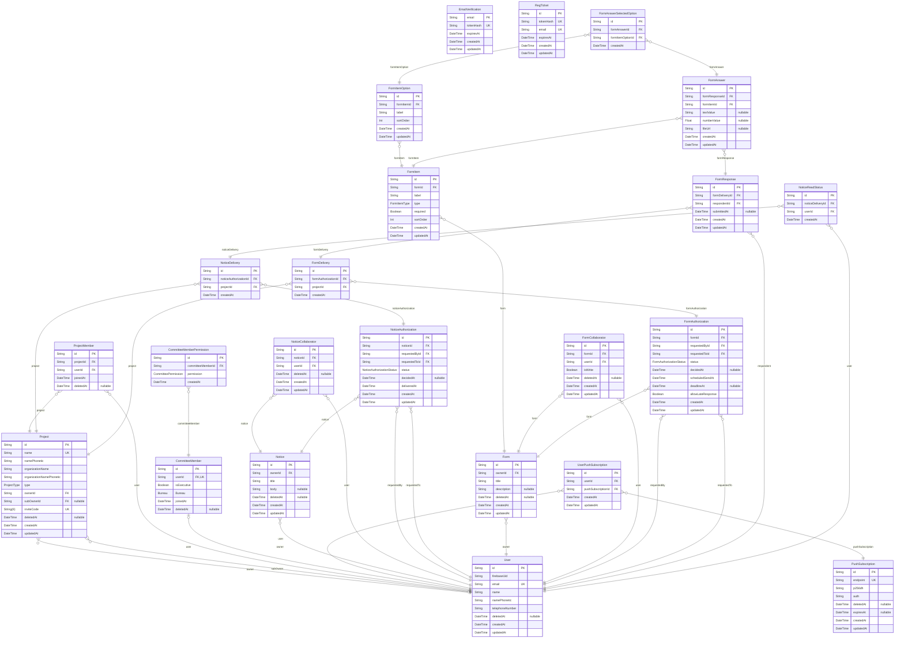

# ER図

> Generated by [`prisma-markdown`](https://github.com/samchon/prisma-markdown)

- [default](#default)

## default

### `EmailVerification`

Properties as follows:

- `email`:
- `tokenHash`:
- `expiresAt`:
- `createdAt`:
- `updatedAt`:

### `RegTicket`

Properties as follows:

- `id`:
- `tokenHash`:
- `email`:
- `expiresAt`:
- `createdAt`:
- `updatedAt`:

### `User`

Properties as follows:

- `id`:
- `firebaseUid`:
- `email`:
- `name`:
- `namePhonetic`:
- `telephoneNumber`:
- `deletedAt`:
- `createdAt`:
- `updatedAt`:

### `Project`

Properties as follows:

- `id`:
- `name`:
- `namePhonetic`:
- `organizationName`:
- `organizationNamePhonetic`:
- `type`:
- `ownerId`:
- `subOwnerId`:
- `inviteCode`:
- `deletedAt`:
- `createdAt`:
- `updatedAt`:

### `ProjectMember`

Properties as follows:

- `id`:
- `projectId`:
- `userId`:
- `joinedAt`:
- `deletedAt`:

### `CommitteeMember`

Properties as follows:

- `id`:
- `userId`:
- `isExecutive`:
- `Bureau`:
- `joinedAt`:
- `deletedAt`:

### `CommitteeMemberPermission`

Properties as follows:

- `id`:
- `committeeMemberId`:
- `permission`:
- `createdAt`:

### `PushSubscription`

Properties as follows:

- `id`:
- `endpoint`:
- `p256dh`:
- `auth`:
- `deletedAt`:
- `expiresAt`:
- `createdAt`:
- `updatedAt`:

### `UserPushSubscription`

Properties as follows:

- `id`:
- `userId`:
- `pushSubscriptionId`:
- `createdAt`:
- `updatedAt`:

### `Notice`

Properties as follows:

- `id`:
- `ownerId`:
- `title`:
- `body`:
- `deletedAt`:
- `createdAt`:
- `updatedAt`:

### `NoticeCollaborator`

Properties as follows:

- `id`:
- `noticeId`:
- `userId`:
- `deletedAt`:
- `createdAt`:
- `updatedAt`:

### `NoticeAuthorization`

Properties as follows:

- `id`:
- `noticeId`:
- `requestedById`:
- `requestedToId`:
- `status`:
- `decidedAt`:
- `deliveredAt`:
- `createdAt`:
- `updatedAt`:

### `NoticeDelivery`

Properties as follows:

- `id`:
- `noticeAuthorizationId`:
- `projectId`:
- `createdAt`:

### `Form`

Properties as follows:

- `id`:
- `ownerId`:
- `title`:
- `description`:
- `deletedAt`:
- `createdAt`:
- `updatedAt`:

### `FormItem`

Properties as follows:

- `id`:
- `formId`:
- `label`:
- `type`:
- `required`:
- `sortOrder`:
- `createdAt`:
- `updatedAt`:

### `FormItemOption`

Properties as follows:

- `id`:
- `formItemId`:
- `label`:
- `sortOrder`:
- `createdAt`:
- `updatedAt`:

### `FormCollaborator`

Properties as follows:

- `id`:
- `formId`:
- `userId`:
- `isWrite`:
- `deletedAt`:
- `createdAt`:
- `updatedAt`:

### `FormAuthorization`

Properties as follows:

- `id`:
- `formId`:
- `requestedById`:
- `requestedToId`:
- `status`:
- `decidedAt`:
- `scheduledSendAt`:
- `deadlineAt`:
- `allowLateResponse`:
- `createdAt`:
- `updatedAt`:

### `FormDelivery`

Properties as follows:

- `id`:
- `formAuthorizationId`:
- `projectId`:
- `createdAt`:

### `FormResponse`

Properties as follows:

- `id`:
- `formDeliveryId`:
- `respondentId`:
- `submittedAt`:
- `createdAt`:
- `updatedAt`:

### `FormAnswer`

Properties as follows:

- `id`:
- `formResponseId`:
- `formItemId`:
- `textValue`:
- `numberValue`:
- `fileUrl`:
- `createdAt`:
- `updatedAt`:

### `FormAnswerSelectedOption`

Properties as follows:

- `id`:
- `formAnswerId`:
- `formItemOptionId`:
- `createdAt`:

### `NoticeReadStatus`

Properties as follows:

- `id`:
- `noticeDeliveryId`:
- `userId`:
- `createdAt`:
