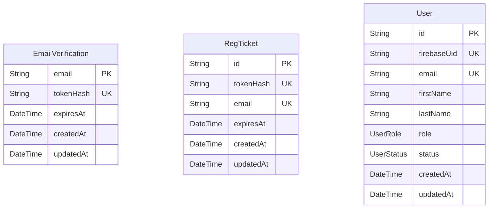

# ER図

> Generated by [`prisma-markdown`](https://github.com/samchon/prisma-markdown)

- [default](#default)

## default

### `EmailVerification`

Properties as follows:

- `email`:
- `tokenHash`:
- `expiresAt`:
- `createdAt`:
- `updatedAt`:

### `RegTicket`

Properties as follows:

- `id`:
- `tokenHash`:
- `email`:
- `expiresAt`:
- `createdAt`:
- `updatedAt`:

### `User`

Properties as follows:

- `id`:
- `firebaseUid`:
- `email`:
- `firstName`:
- `lastName`:
- `role`:
- `status`:
- `createdAt`:
- `updatedAt`:
